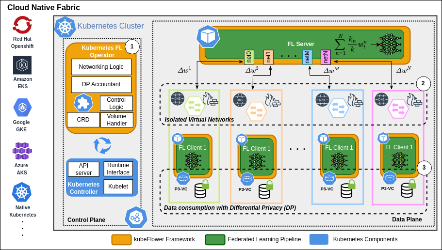
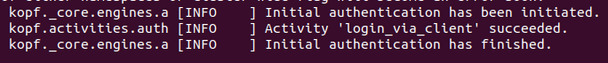

# KubeFlower: Kubernetes-based Federated Learning

*** Work on top of our previous repo [KubeFlower](https://github.com/hpn-bristol/kubeFlower) ***

## What is KubeFlower?
Kubeflower is a project for exploring the benefits of cloud-native and container-based technologies for the development, deployment and workload management of Federated Learning (FL) pipelines. We use the open-source framework [Flower](https://flower.dev/) for the FL workload control. Flower has been widely adopted in industry and academia. In order to increase computation elasticity and efficiency when deploying FL, we use the container orchestration system [Kubernetes](https://kubernetes.io/) (K8s). We use different concepts such as FL server, FL clients, K8s clusters, K8s operators, K8s CNIs, K8s CRDs, K8s deployments, K8s pods, and K8s services. If you are not familiar with this terminology, please watch the following resources: [Federated Learning](https://youtu.be/nBGQQHPkyNY), [Kubernetes](https://youtu.be/s_o8dwzRlu4). The implementation in this repo makes reference to our FGCS paper ["kubeFlower: A privacy-preserving framework for Kubernetes-based federated learning in cloud-edge environments"](https://www.sciencedirect.com/science/article/pii/S0167739X24001134).



## Top-Level Features
* Single and multi-node implementation.
* High availability through clustering and distributed state management.
* Privacy-preserving mechanisms at the system and application level.
   * Isolation-by-design
   * Differentially private data consumption
* Scalability through clustering of network device control.
* CLI for debugging.
* Applicable to real-world scenarios.
* Extendable.
* Cross-platform (Linux, macOS, Windows).

## Getting started

### Dependencies

For this proof-of-concept, a K8s cluster is deployed. The following packages are required and should be installed beforehand:
* [git](https://git-scm.com/)
* [docker](https://www.docker.com/)
* [kubernetes](https://kubernetes.io/docs/setup/production-environment/tools/)
* [kube-ovn](https://kubeovn.github.io/docs/v1.12.x/en/start/one-step-install/)
* [python3](https://www.python.org/downloads/)
* [multus-cni](https://github.com/k8snetworkplumbingwg/multus-cni/blob/master/docs/quickstart.md)
* [kubernetes operator framework (kopf)](https://github.com/nolar/kopf/tree/main)

### Requirements
* A Kubernetes cluster: Single node (e.g., with [kind](https://kind.sigs.k8s.io/)), or multi-node with standard Kubernetes.
* KubeOVN as CNI: Don't use the standard network CNIs (i.e. Calico or Flanel). Please check [networks](networks/).
* If using network isolation, the clients' datasets need to be located (downloaded) on the relevant nodes as the clients will be isolated from the internet. 

### Step-by-step setup
 1. Clone the present repository in the CLI.
 ```bash
    git clone git@github.com:hpn-bristol/KubeFlower.git
 ```
 2. Install Python libraries Kopf and Kubernetes python client. You can use environment managers if desired.
 ```bash
    pip install kopf
    pip install kubernetes  
 ```
 3. Go to the folder that contains Kubeflower: 
 ```bash
    cd kubeFlower-Operator/
 ```
 ### Step-by-step deployment
 Now you are ready to deploy the FL pipeline using K8s. We will be using K8s deployments to create K8s pods that will use a K8s service for communications. Each pod represents an FL actor with a main pod that will act as an FL server. The proposed architecture is depicted in the figure. 

 The docker image `kubeflower` is used to deploy the containers with the Flower's pipeline and other dependencies. The image used for this PoC is publicly available at Docker Hub [kubeflower](https://hub.docker.com/r/juanmarcelouob/kubeflower). These containers are deployed in pods. The FL server Pod exposes port 8080 for the gRPC communication implemented by Flower. 
For the FL setup, we use the FL PyTorch implementation of Flower. This simple example can be found [here](https://flower.dev/docs/quickstart-pytorch.html). 

To deploy this architecture you need to:

1. Deploy the CRD `flwr-crd.yaml` K8s service. From the root folder run:
    ```bash
    kubectl apply -f operator/flwr-crd.yaml
    ```
2. Check the successful installation of the CRD.
   ```bash
   kubectl get crd | grep fldeployments
   ```
3. Deploy the Virtual Networks:
    Please follow the instructions in [networks](networks/).    
4. Deploy the kubeFlower operator using KOPF `fl_operator.py`. From the root folder run:
   ```
   kopf run operator/fl_operator.py 
   ``` 
   You should see the following output:
   
   
   
6. Deploy the FL server and clients. You can do it individually or all in one go. The following example descriptor (`flwr-deploy.yaml`) deploys a FL server and 10 clients with network isolation and a privacy budget of 0.7:
   ```yaml
   apiVersion: flwr.dev/v1
   kind: FLDeployment
   metadata:
   name: fl-deployment
   finalizers:
   spec:
   server:
      imagePullPolicy: IfNotPresent
      port: 8080
      rounds: 10
   client:
      num_clients: 10
      imagePullPolicy: IfNotPresent
      isolation: True
      port: 30051
      dataset:
         download: False
      privacy:
         budget: 0.7
   ```
   To deploy the descriptor run:
   ```bash
   kubectl apply -f operator/flwr-deploy.yaml
   ``` 


This is a simple implementation of container-based FL using Flower and K8s for orchestration. For further comments/discussions/ideas/projects, please contact the developers.  

### Citation
If you publish work that uses kubeFlower, please cite it as follows:
```
@article{parra2024kubeflower,
  title={kubeFlower: A privacy-preserving framework for Kubernetes-based federated learning in cloud-edge environments},
  author={Parra-Ullauri, Juan Marcelo and Madhukumar, Hari and Nicolaescu, Adrian-Cristian and Zhang, Xunzheng and Bravalheri, Anderson and Hussain, Rasheed and Vasilakos, Xenofon and Nejabati, Reza and Simeonidou, Dimitra},
  journal={Future Generation Computer Systems},
  year={2024},
  publisher={Elsevier}
}
```

### TODO
Some possible extensions:
* Automatic network definitions
* Extensions for more Datasets and models
* FL server and clients scripts model and data indepent
* Network isolation with tunneling for external communications (if desired)
* DP optimisation
* Personalised DP 
* Data reuse
* Resource optimisation

### Contact
For more information contact the development team and the corresponding author Juan Marcelo Parra-Ullauri.
