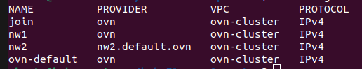

## Network Isolation
In this section, we will show an example for configuring Kube-ovn for creating network isolation on-demand. 
Please follow the installation and configuration following this [link](https://kubeovn.github.io/docs/v1.11.x/en/guide/subnet/#subnet-isolation).

### Check which networks are available
```bash
kubectl get subnets
```
### Create 2 isolated subnets that do not overlap
Use the descriptor networks/subnets-deploy.yaml.
```bash
kubectl apply -f subnets-deploy.yaml 
```
### Check the subnets have been properly created.
```bash
kubectl get subnets
```
You can see nw1 and nw2 have been created. 



### Create pods and attach them to the networks nw1 and nw2
```bash
kubectl apply -f isolated-pods.yaml 
```
Now you can check that the pods are in different networks. For testing isolation, you can do `kubectl exec -it` in each of the pods and try `ping` eachother. 


